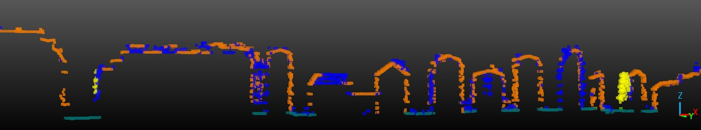
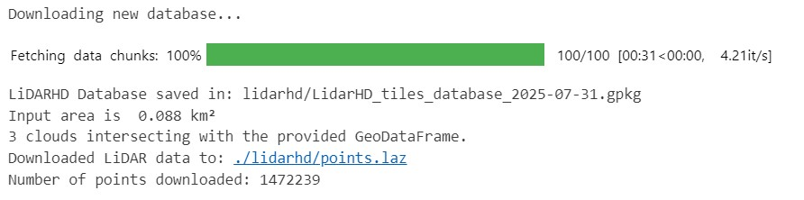

# LiDAR-HD Downloader

## Description

Utility to **download France IGN LiDAR HD** to LAZ file based on AOI (Area of Interest) defined in a GeoPandas GeoDataframe.

##  Usage
- Install Python dependencies : `pip install -r requirements.txt`
- Follow instructions in notebook. Output will be like :  

